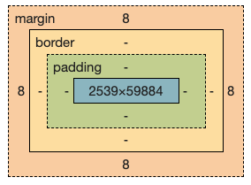

# Terminology
## What is the Web?

Sometimes we the Web and the Internet interchangeably, but technically
they refer to two different, albeit related, concepts. The Internet is
an global infrastructure consists of inter-connected networks of computers,
known as the information highway/speed. The Web is one of the services,
similar to email, that runs on the Internet. The Internet provides the
connectivity and the Web provides the service, which allows users to "browse"
and make use of the resources that are available on the Web.

The Web is enabled through a protocol (HTTP - HyperText Transfer Protocol)
that allows computers on the
Internet to message each other via HTTP requests and responses, which is called
the request and response model. The computer sending a request is called a
client and the computer responding to the request is called a server - the client
server mode.  Most of the time, we (human users) interact
with the web using a program (user agent) called a web browser. The browser
speaks the HTTP protocol so that we don't have to.

When you type a Universal Resource Locator (URL or web address/link) in your
favorite browser on an Internet enabled device. Your browser will send a request to the
"resource" identified by the URL and if it exists that computer that has the
resource will send a response back to your browser. The browser will interpret
the result and render it as a web page. If you click a link on a web page, the
browser will likely send another request kicking start another request and
response cycle.

## What is Web Programming?
Programming the Web or building web apps is about making the web richer by
adding more resources to it. The Web is originally designed as a distributed
system for researchers to share their documents. The documents are organized
hierarchically as in a file system. They documents can be accessed using an URL
and each document can have HyperLinks to other documents, therefore, forming a
"web" of documents. At that time a web browser is truly a document browser
allowing us to "browse" statically stored documents. But, nowadays web browsers
are App viewers. The web pages we see in browsers are interfaces to Apps that
provide any functionality possible, from social media, shopping, to entertainment.

Web programming involves both the client side and the server side. On the client
side we need to know how to define interfaces (web pages) using
HTML and CSS and handle user interactions with JavaScript. On the server side,
we need a server side program that can access resources not available on the
client side, e.g. a file system or a database.

## What is HTML?

[HTML (HyperText Markup Language)](https://www.w3schools.com/html/html_intro.asp)
is a language for defining web pages. Go to
[https://www.w3schools.com/](https://www.w3schools.com/), right click on the
page, and select "View Page Source" to see an example HTML. The HTML code tells
the browser what should be on the web page and how it should be displayed, so
it contains both content and style information. The best practice is separate
the content and the style/presentation. So, we use HTML strictly for content
and structure and use [CSS](https://www.w3schools.com/css/css_intro.asp)
for styling.

## HTML Elements

An HTML file is a plain text file consists of HTML elements. Each element is
defined using a tag. The tag name is the element name. Some elements can contain
other elements, e.g. `<p>`, some have textual content, some have both, and some
have none. Here is a level 1 heading element with textual content.

```
<h1> heading </h1>
---- ------- -----
 |    |        |
 |    content  closing tag
 opening tag

```

Elements can have attributes (required or optional) as modifiers to further define them.
Here is an example of a "anchor" element that defines a HyperLink using
a piece of text, "W3", point to an URL.

```
<a href="https://www.w3.org"> W3 </a>
-- ---- --------------------     ----
|   |            |                 |
|   |            attribute value   closing tag
|   attribute name
opening tag
```

Here is an example HTML file with a variety of elements:
```html
<!DOCTYPE html>
<html>
  <head>
    <meta charset="utf-8">
    <meta name="viewport" content="width=device-width">
    <title>HTML Example</title>
    <link href="style.css" rel="stylesheet" type="text/css" />
  </head>
  <body>
    <h1>This is a heading</h1>
    <p>This is a paragraph.</p>
    <ul>
      The secrete to happiness:
      <li>eat</li>
      <li>drink</li>
      <li>be merry</li>
    </ul>
    You can learn about HTML at <a href="https://www.w3schools.com/"> w3schools </a>.
  </body>
</html>
```
You can try the code at https://repl.it/@lubaochuan/DecimalWelcomeMicrocode

The following is an example `meta` tag that describes the content
of this web page.
```
<meta name="description" content="Learn to HTML and CSS to build web pages">
```
We can also use a `meta` tag to tell web crawlers not to following
links on a web page.
```
<meta name="robots" content="nofollow">
```

To avoid mistakes in HTML we can use W3C's Markup Validation Service
to help validate HTML documents:https://validator.w3.org/

### semantic tags
<article>
<aside>
<details>
<figcaption>
<figure>
<footer>
<header>
<main>
<mark>
<nav>
<section>
<summary>
<time>
https://www.w3schools.com/html/html5_semantic_elements.asp

The `<section>` tag defines, in a document, a section -
a thematic grouping of content, typically with a heading.

The `<article>` tag defines independent, self-contained content, e.g. forum post, blog post, and newspaper article.

The `<header>` tag defines a container for introductory content
or a set of navigational links. It typically contains one or more
heading elements (`<h1>...<h6>`), logo or icon, and authorship
information.

The `<footer>` tag defines a footer for a document or section.
It typically contains authorship information, copyright information,
contact information, sitemap, back to top links, and related documents.

The `<nav>` tag defines a set of (major) navigation links.

The `<aside>` tag defines some content aside from the content it
is placed in (like a sidebar).

The `<figure>` tag defines self-contained content, e.g. illustrations,
diagrams, photos, and code listings.

The `<figcaption>` tag defines a caption for a `<figure>` element.

## Page Layout

An HTML file defines the content and the structure of a web page using HTML elements that are nested in a tree structure. This structure along with the CSS rules determines the layout of the page - which element is in which element and their position on the web page.

Each element is represented internally as a box (the box model):



responsive layout example
https://repl.it/@lubaochuan/HumbleFrighteningLinuxkernel

blog layout example
https://repl.it/@lubaochuan/UncomfortableAnguishedBookmark

CSS `flexbox` layout
https://www.w3schools.com/css/css3_flexbox.asp


block and inline elements

https://repl.it/@lubaochuan/SaddlebrownThirstyCosmos

validators

HTML5 https://repl.it/@lubaochuan/IndianredImaginativeCommercialsoftware

CSS https://repl.it/@lubaochuan/StaticWholeDevelopers

## What is CSS?

### Colors 

First example https://replit.com/@lubaochuan/StarryPeacefulPaintprogram

All colors https://www.w3schools.com/css/css_colors.asp

### Fonts

First example https://replit.com/@lubaochuan/DelectableBoilingRelationaldatabase

Fonts reference https://www.w3schools.com/css/css_font.asp

basic CSS
https://repl.it/@lubaochuan/TestyFumblingBytes

page layout using float
https://repl.it/@lubaochuan/InnocentElatedVirtualmemory

page layout using flex
https://repl.it/@lubaochuan/NegativeOrangeMetric

page layout using grid
https://repl.it/@lubaochuan/MediumorchidAgileGraph

page layout with semantic elements
https://repl.it/@lubaochuan/ImmenseFussyAutomatedinformationsystem

semantic markup

CSS reset
```
* {
  margin: 0;
  padding: 0;
}
```

form with label
https://repl.it/@lubaochuan/ScientificSpecificDownloads

checkboxes (radio)
https://repl.it/@lubaochuan/WearyMotionlessProblems

fieldset
https://repl.it/@lubaochuan/ActiveHarshMysql

styled form
https://repl.it/@lubaochuan/CrispModestPixels

Responsive

show warning
https://repl.it/@lubaochuan/CarefulTurbulentVolume

change page layout
https://repl.it/@lubaochuan/SelfreliantHumblePolygons


custom element
https://repl.it/@lubaochuan/OverdueQuickPcboard
https://repl.it/@lubaochuan/ChocolateLongDatalogs

extend a built-in element
https://repl.it/@lubaochuan/BossyWellwornPasswords
